# Architecture Diagram Manual

Generated at: 2026-02-19 06:07:50Z

## Flow Type
Lazy Repo Onboarding + On-demand Retrieval

## Detected Components
- CLI/API orchestration
- GitHub Trees API integration
- PostgreSQL-backed vector + metadata storage
- Pluggable embedding providers

## Sequence Diagram (Mermaid)

```mermaid
sequenceDiagram
    participant U as User
    participant C as CLI / API
    participant G as GitHub Trees API
    participant D as PostgreSQL
    participant E as Embedding Provider

    rect rgb(55, 55, 55)
    note over U,E: Phase 1: Instant Onboarding
    U->>C: ragops repo add-lazy <url>
    C->>G: Fetch file tree (1 API call)
    G-->>C: File paths + metadata
    C->>E: Embed file paths only
    C->>D: Store in {collection}_tree + repo_files
    C-->>U: Ready! (N embeddable files)
    end

    rect rgb(55, 55, 55)
    note over U,E: Phase 2: On-demand per Query
    U->>C: ragops chat --collection <col> "question"
    C->>D: Search {collection}_tree for relevant paths
    D-->>C: Top matching file paths
    C->>G: Fetch only those file contents
    C->>E: Embed + cache file contents
    C->>D: Search {collection} for answer chunks
    D-->>C: Grounded chunks + citations
    C-->>U: Answer with citations
    end
```

## Notes
1. This diagram is generated deterministically from detected project modules.
2. It is intended for onboarding and architecture communication.
3. Render in GitHub/Markdown viewer with Mermaid support.
